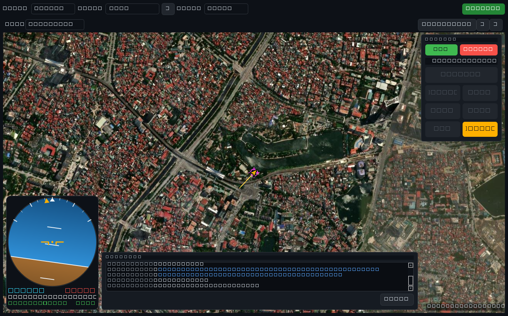

# Lite Ground Station — Desktop (Windows / Linux)

A cross-platform desktop port of the CrowPanel ESP32 ground station, written in
**Python + PySide6 (Qt) + pymavlink**. It is a **map-centric fly view** for
autonomous work: the satellite map fills the window and the instruments float on
top. It receives & decodes MAVLink telemetry, shows a compact circular HUD, and
— unlike the embedded version — can **command the vehicle**: arm/disarm, one-tap
flight modes (LOITER / STAB / ALTH / LAND, +RTL/GUIDED), takeoff, and guided
"Fly To Here".



## Features

- **Map-centric fly view** — the satellite map is the workspace (fills the
  window); a top status bar, a left action rail, a small **circular HUD** and the
  message log float over it as overlays, like a modern GCS fly view.
- **Live camera + picture-in-picture switch** — a **webcam view** (Qt
  Multimedia) is a second full-screen-capable view alongside the map. One view
  is primary (fills the window), the other shrinks to a **corner PIP tile**; tap
  the tile (or press **`V`**) to swap which one is the main view. Pick the camera
  device and start/stop the feed from its header strip.
- **Full-width status bar** — a frosted top bar (NASA-ground-station style) with
  the vehicle name and link dot on the left, and on the right the live
  **battery / GPS / link** chips, a **flight-mode pill** (click to pick a mode)
  and an **arm/disarm pill** (green when safe, red when armed). While
  disconnected the connection card floats as a **centred hero** so the top
  controls stay clear of it; *Disconnect* lives on the bar once a link is up.
  Press **`F11`** for fullscreen — handy on a small dedicated panel.
- **Left action rail** — a vertical strip of big one-tap buttons down the left
  edge — **LAND · RETURN (RTL) · PAUSE (LOITER) · ACTION (take off)** — that
  light up when that mode goes live, plus a SINGLE/MULTI selector. Arm/takeoff
  confirmations guard the dangerous actions.
- **Circular attitude HUD** — a round PFD "ball" showing only the IMU picture:
  gradient sky/ground horizon clipped to a circle, roll scale on the bezel, amber
  boresight, a heading (yaw) box and a single altitude readout. Everything scales
  from the widget size and stays glanceable even when small.
- **Responsive** — overlays reposition to the window size and shrink when
  cramped (the message log hides first; the HUD, PIP tile and top pill all scale
  down and the control column narrows), so it works from a wide desktop, down to
  a small **4.3" FullHD** dedicated panel (Qt high-DPI scaling), down to a
  **~480×272** panel. The primary view always stays the focus.
- **Arm · mode · takeoff from the chrome** — the **arm/disarm pill** and
  **flight-mode pill** on the status bar, and the **action rail** on the left
  (LAND/RETURN/PAUSE/take off), all follow the vehicle's live armed state and
  mode from incoming HEARTBEATs and announce intent to the command service. Arm
  and takeoff prompt for confirmation; takeoff prompts for an altitude and
  auto-switches to GUIDED.
- **Telemetry stream requests** — on connect the GCS asks the vehicle to stream
  `ATTITUDE` (the HUD horizon), position and status (via `REQUEST_DATA_STREAM` +
  `SET_MESSAGE_INTERVAL`), re-requesting periodically. Without this a real
  ArduPilot/PX4 vehicle leaves the artificial horizon frozen even though the link
  is up, because it only streams `ATTITUDE` when a GCS asks for it.
- **Guided "Fly To Here"** — right-click anywhere on the map → *Fly To Here* and
  the vehicle flies to that point (auto-switches to GUIDED, sends a
  `SET_POSITION_TARGET_GLOBAL_INT`). A magenta target marker shows the goal; set
  the guided altitude or clear the target from the same menu.
- **Messages log (Mission-Planner style)** — every STATUSTEXT, COMMAND_ACK and
  local notice, **colour-coded by severity**. Warnings and errors are *also*
  surfaced as **banners over the map** (top-centre, auto-fading, click-through)
  so the operator never has to look away from the flight area to catch a pre-arm
  failure or battery alarm.
- **Satellite map** — Web-Mercator XYZ tiles (Esri imagery by default, OSM
  street as an option) with a heading-rotated drone marker, breadcrumb trail,
  follow/pan/zoom, and an on-disk tile cache.
- **3D globe** — a **`3D`** toggle in the map bar swaps the 2D tiles for a
  **CesiumJS** globe (in a `QWebEngineView`) draped with the same Esri imagery,
  so no Cesium ion token is needed. The vehicle, the waypoint mission and the
  simulation all render in 3D with altitude; *Follow* tracks the vehicle/sim.
  Cesium is **vendored** under `gcs/ui/assets/cesium/` and served by a localhost
  HTTP server, so the 3D engine works **offline** — only the satellite imagery
  needs the network, exactly like the 2D map.
- **Waypoint mission** — toggle **`✎ WP`** then click the map to drop numbered
  waypoints, drag to move them, right-click/double-click to delete, and set a
  per-waypoint altitude. The dashed route, leg lengths and total distance show on
  the 2D map and as 3D points with altitude poles on the globe. One shared
  mission backs both views, so an edit in either updates both.
- **Flight simulation (preview)** — **`▶ Sim`** flies a green marker along the
  planned route at a chosen groundspeed (5–40 m/s) on both the 2D and 3D maps —
  a local visual preview of the path; it commands nothing on the vehicle.
- **Upload & fly the mission** — **Plan → Upload to vehicle** turns the planned
  waypoints into a real ArduCopter mission (home · take-off · waypoints) and
  sends it over the MAVLink MISSION protocol (`MISSION_COUNT` →
  `MISSION_ITEM_INT` → `MISSION_ACK`); **Start mission (AUTO)** switches the
  vehicle to AUTO and runs it (`MAV_CMD_MISSION_START`). Both are guarded by a
  confirmation, and the on-touch waypoint editor (tap a point → set altitude /
  delete) makes the route editable with a finger on a touchscreen.
- **Links** — Serial (USB telemetry radio), UDP (SITL / the ESP32's WiFi
  forward / the bundled simulator), or TCP (SITL).

## Architecture (SOLID)

```
gcs/
  domain/      telemetry value objects + flight-mode tables   (pure data, no I/O)
  interfaces/  ITelemetryLink (read) + ICommandSink (write)    (DIP / ISP ports)
  mavlink/     PymavlinkLink, TelemetryDecoder, CommandService, MissionService (pymavlink)
  app/         TelemetryStore (mutex), LinkManager (worker thread), GcsController (root)
  ui/          HUD, panels, map, connection bar, MainWindow     (passive Qt views)
  config.py    persisted connection settings
main.py        entry point
tools/sim_udp.py   interactive MAVLink simulator (no hardware needed)
```

- **SRP** — each class has one job (decode, store, command, draw…).
- **OCP** — add a transport by implementing the ports; add a vehicle's modes by
  adding a `ModeTable`; add a map source by adding a `TileProvider`. No edits to
  callers.
- **LSP** — `PymavlinkLink` is used purely through the port interfaces.
- **ISP** — readers depend on `ITelemetryLink`, the command service on
  `ICommandSink`; neither drags in the other.
- **DIP** — `app/` and `ui/` depend on abstractions; only `mavlink/` imports
  pymavlink. The UI is Qt-only and never blocks on I/O (it polls a thread-safe
  store on a timer); the worker is I/O-only and never touches Qt.

## Install & run

```bash
cd desktop
python -m pip install -r requirements.txt     # PySide6, pymavlink, pyserial
python main.py
```

Pick a link in the top bar and press **Connect**.

### Try it without a drone

In one terminal run the simulator, in another run the app and connect via **UDP**
on port **14550** (the default in the bar):

```bash
python tools/sim_udp.py          # streams ArduCopter telemetry + answers commands
python main.py                   # Link: UDP, port 14550, Connect
```

The simulator answers ARM/DISARM, SET_MODE, **NAV_TAKEOFF** and
**SET_POSITION_TARGET** (Fly To Here), so every button visibly works: arm →
TAKEOFF makes the marker climb; right-click the map → *Fly To Here* makes it fly
to the point. It also refuses arming for the first few seconds so you can see a
pre-arm **error** in the message log and banner — exactly like Mission Planner.

### Connect to a real vehicle

- **Serial**: choose *Serial*, pick the COM port / `/dev/ttyUSB*`, set the baud
  (telemetry radios are usually `57600`), Connect.
- **UDP**: point SITL or the ESP32's WiFi-forward at this machine's UDP `14550`.
- **TCP**: SITL on `127.0.0.1:5760`.

> Arming spins motors. The app asks for confirmation and *Force* skips the
> vehicle's pre-arm safety checks — use it only on the bench with props off.

## Package a Windows .exe (optional)

```bash
python -m pip install pyinstaller
pyinstaller --noconsole --name LiteGCS --add-data "gcs;gcs" main.py
# dist/LiteGCS/LiteGCS.exe
```

## Notes

- Flight-mode names/numbers follow the ArduPilot **Copter** table (matches the
  firmware's `FlightMode.h`). Add other vehicles in `gcs/domain/flight_modes.py`.
- Settings persist to `~/.lite_gcs/config.json`; tiles cache under
  `~/.lite_gcs/tiles/`.
